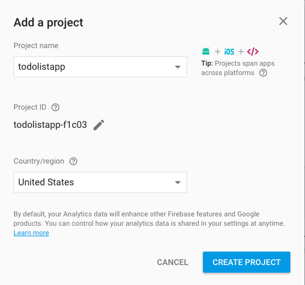
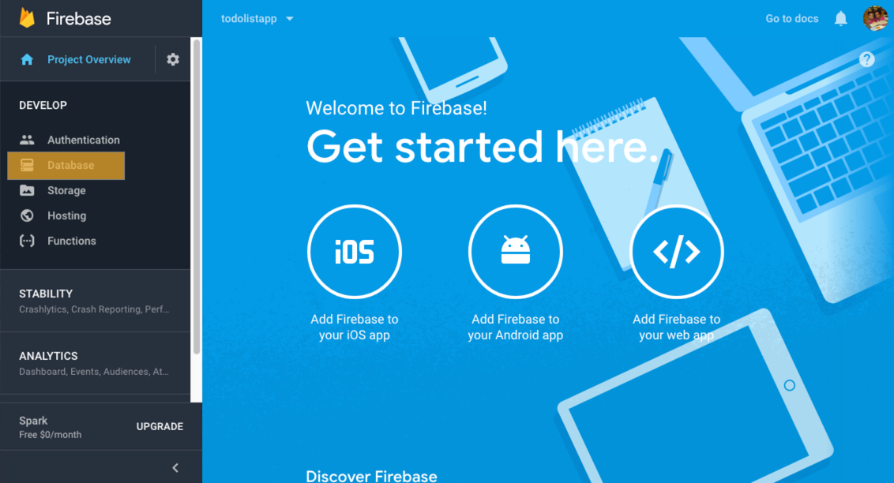
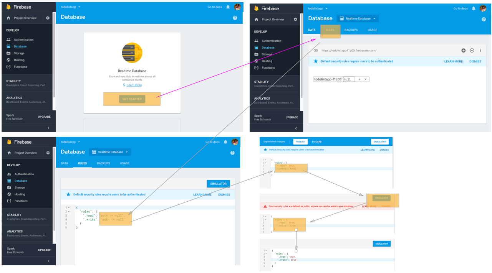
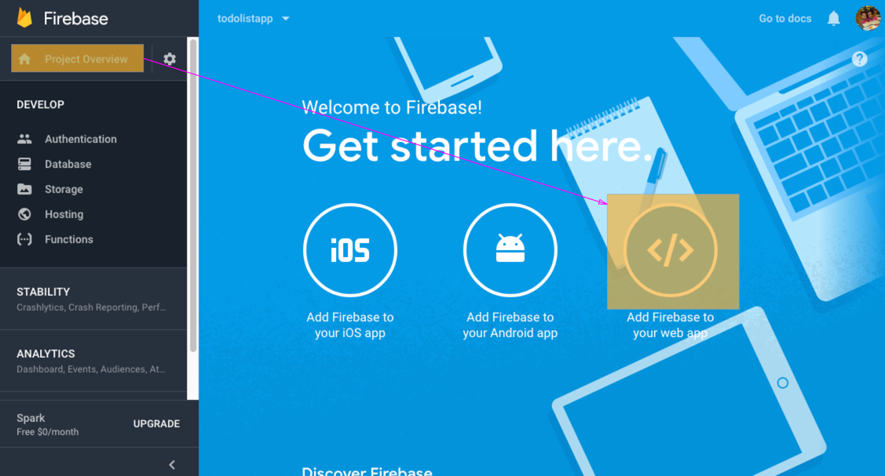
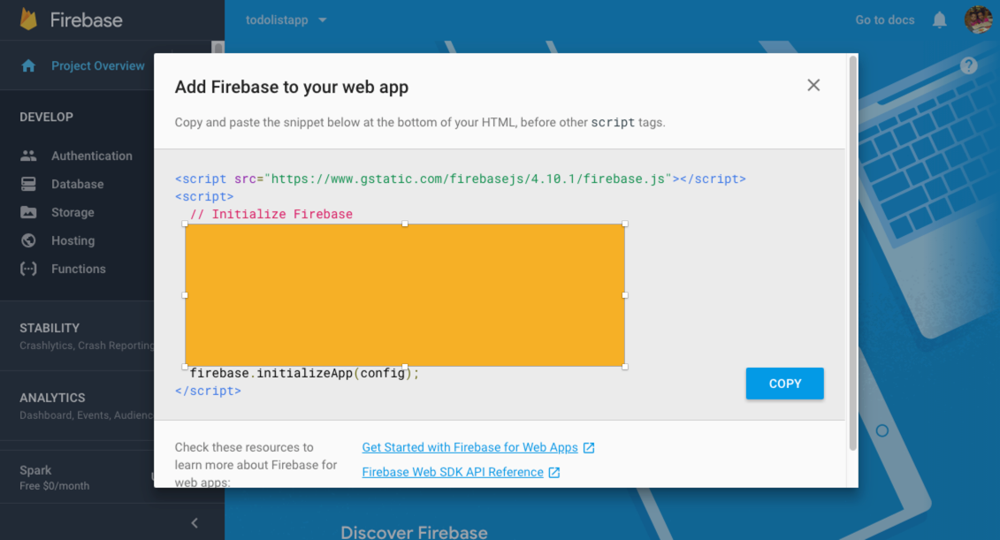
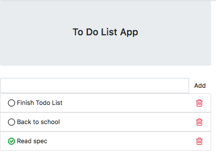

### generate Todolistapp

### Add todolistapp project in firebase


### change database permission





### update firebase connection
```
export const environment = {
  production: false,
  firebase: {
    apiKey: 'AIzaSyABrj9FVDg6qwWSWSrySku5GhQGtPKnwmYA',
    authDomain: 'todolistapp-f1c03.firebaseapp.com',
    databaseURL: 'https://todolistapp-f1c03.firebaseio.com',
    projectId: 'todolistapp-f1c03',
    storageBucket: 'todolistapp-f1c03.appspot.com',
    messagingSenderId: '1062157569815'
  }
};
```


### Install firebase packages
```
npm install firebase@4.6.1 angularfire2@5.0.0-rc.3 --save
```

### update app module to connect with firebase
```
import { AngularFireModule } from 'angularfire2';
import { AngularFireDatabase } from 'angularfire2/database';
import { environment } from '../environments/environment';

imports: [
    AngularFireModule.initializeApp(environment.firebase),
  ],
```

### Create todo component
``` 
ng g c todo
```
### Create todo service
``` 
ng g s todo
```


### Install font aweseme
```
npm install font-awesome --save
```

### 
